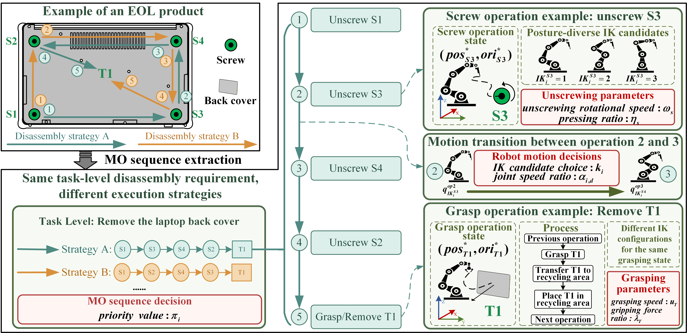

# MOA-EP-RDSP Dataset and Experimental Results

Data and experimental results for **Meta-operation-assisted optimization for execution-parameterized robotic disassembly sequence planning**.

Only data and experimental results will be released here. Implementation code for the compared algorithms is not included.

## Background

Figure 1 illustrates the execution-parameterized expansion of robotic disassembly sequence planning, where task-level disassembly operations are coupled with feasible robot configurations and execution parameters.

## Repository structure

- `input_data/product_instances/`: product instance information for the 15 experimental products.
- `input_data/rf_training_samples/`: training samples used for the RF-based MOA guidance model.
- `results/experiment1_moa_vs_moea_same_hv/`: Experiment 1 results for MOA-assisted MOEAs versus base MOEAs under the same-HV setting.
- `results/experiment2_moa_vs_frameworks_same_time/`: Experiment 2 results for MOA(ours) versus other frameworks under the same-time setting.
- `results/combined/`: merged summary workbooks/tables for the two formal experiments.
- `figures/`: paper-ready figures generated from the formal experimental results.
- `docs/`: notes for data format, metrics, and reproduction details.

The folders currently contain only placeholders. Files will be added gradually.

